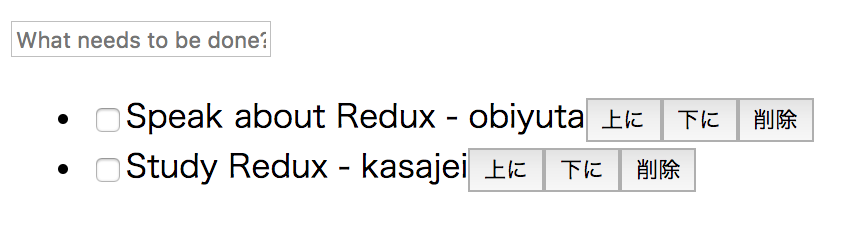

# react-redus-study



# Requirements

* docker
* docker-compose
* docker-sync

__Recommended__

* [Redux DevTools Extension](https://chrome.google.com/webstore/detail/redux-devtools/lmhkpmbekcpmknklioeibfkpmmfibljd)

# Installations

```
./bin/setup
```

Then, you can access [http://localhost:8888/](http://localhost:8888/).
